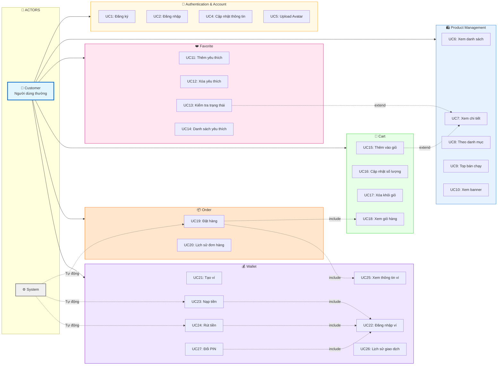
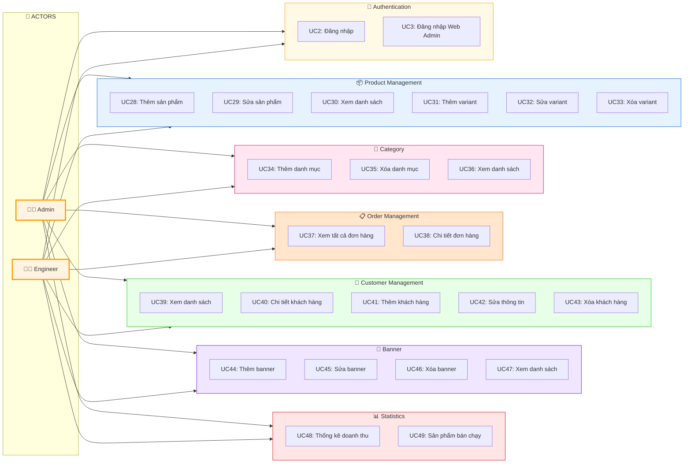

# Use-Case Diagram - Hệ thống ClosetHub

## 📊 Use-Case Diagram Tổng Quan

### Diagram 1: Customer Use Cases



### Diagram 2: Admin & Engineer Use Cases



---

## 📋 Chi tiết Use Cases

### 🔐 1. Authentication & Account Management

| ID | Use Case | Actor | Mô tả |
|:--:|---------|-------|-------|
| **UC1** | Đăng ký tài khoản | Customer | Người dùng đăng ký tài khoản mới với email, password, có thể upload avatar |
| **UC2** | Đăng nhập | Customer, Admin, Engineer | Đăng nhập vào hệ thống, nhận JWT token |
| **UC3** | Đăng nhập Web Admin | Admin, Engineer | Đăng nhập vào web admin panel (chỉ admin và engineer) |
| **UC4** | Cập nhật thông tin cá nhân | Customer | Cập nhật email, phone, name, address |
| **UC5** | Upload Avatar | Customer | Upload ảnh đại diện mới |

### 🛍️ 2. Product Management - Customer

| ID | Use Case | Actor | Mô tả |
|:--:|---------|-------|-------|
| **UC6** | Xem danh sách sản phẩm | Customer | Xem tất cả sản phẩm còn hàng, có thể lọc theo user_id để hiển thị favorite |
| **UC7** | Xem chi tiết sản phẩm | Customer | Xem thông tin chi tiết, variants (size, color), giá, số lượng |
| **UC8** | Xem sản phẩm theo danh mục | Customer | Lọc sản phẩm theo category ID |
| **UC9** | Xem top sản phẩm bán chạy | Customer | Xem top 10 sản phẩm bán chạy (30 ngày hoặc all-time) |
| **UC10** | Xem banner khuyến mãi | Customer | Xem danh sách banner khuyến mãi trên home |

### ❤️ 3. Favorite Management

| ID | Use Case | Actor | Mô tả |
|:--:|---------|-------|-------|
| **UC11** | Thêm vào yêu thích | Customer | Thêm sản phẩm vào danh sách yêu thích |
| **UC12** | Xóa khỏi yêu thích | Customer | Xóa sản phẩm khỏi danh sách yêu thích |
| **UC13** | Kiểm tra trạng thái yêu thích | Customer | Kiểm tra sản phẩm có trong yêu thích không |
| **UC14** | Xem danh sách yêu thích | Customer | Xem tất cả sản phẩm đã yêu thích |

### 🛒 4. Cart Management

| ID | Use Case | Actor | Mô tả |
|:--:|---------|-------|-------|
| **UC15** | Thêm sản phẩm vào giỏ hàng | Customer | Thêm variant vào giỏ, kiểm tra tồn kho |
| **UC16** | Cập nhật số lượng giỏ hàng | Customer | Tăng/giảm số lượng, nếu = 0 thì xóa |
| **UC17** | Xóa sản phẩm khỏi giỏ hàng | Customer | Xóa item khỏi giỏ hàng |
| **UC18** | Xem giỏ hàng | Customer | Xem danh sách items với thông tin product và variant |

### 📦 5. Order Management - Customer

| ID | Use Case | Actor | Mô tả |
|:--:|---------|-------|-------|
| **UC19** | Đặt hàng | Customer | Đặt hàng từ giỏ hàng, chọn shipping và payment method. Nếu online thì trừ tiền ví |
| **UC20** | Xem lịch sử đơn hàng | Customer | Xem tất cả đơn hàng đã đặt với chi tiết sản phẩm |

### 💰 6. Wallet Management

| ID | Use Case | Actor | Mô tả |
|:--:|---------|-------|-------|
| **UC21** | Tạo ví điện tử | Customer | Tạo ví mới với PIN 6 số |
| **UC22** | Đăng nhập ví | Customer | Xác thực PIN để truy cập ví |
| **UC23** | Nạp tiền vào ví | Customer | Nạp tiền (có thể yêu cầu PIN), tạo transaction |
| **UC24** | Rút tiền từ ví | Customer | Rút tiền (bắt buộc PIN), tạo transaction |
| **UC25** | Xem thông tin ví | Customer | Xem số dư, wallet number |
| **UC26** | Xem lịch sử giao dịch | Customer | Xem tất cả giao dịch (deposit, withdraw, payment) |
| **UC27** | Đổi PIN ví | Customer | Đổi PIN cũ sang PIN mới (xác thực PIN cũ) |

---

## 👨‍💼 ADMIN & ENGINEER USE CASES

### 📦 7. Product Management - Admin

| ID | Use Case | Actor | Mô tả |
|:--:|---------|-------|-------|
| **UC28** | Thêm sản phẩm | Admin, Engineer | Thêm product mới với variants, upload ảnh |
| **UC29** | Sửa sản phẩm | Admin, Engineer | Sửa tên, mô tả sản phẩm |
| **UC30** | Xem danh sách sản phẩm Admin | Admin, Engineer | Xem tất cả variants với thông tin product |
| **UC31** | Thêm biến thể sản phẩm | Admin, Engineer | Thêm variant mới vào product đã có (nếu productCode trùng) |
| **UC32** | Sửa biến thể sản phẩm | Admin, Engineer | Sửa size, color, price, quantity, image của variant |
| **UC33** | Xóa biến thể sản phẩm | Admin, Engineer | Xóa mềm variant (is_deleted = true) |

### 📁 8. Category Management - Admin

| ID | Use Case | Actor | Mô tả |
|:--:|---------|-------|-------|
| **UC34** | Thêm danh mục | Admin, Engineer | Thêm category mới |
| **UC35** | Xóa danh mục | Admin, Engineer | Xóa category |
| **UC36** | Xem danh sách danh mục | Admin, Engineer | Xem tất cả categories |

### 📋 9. Order Management - Admin

| ID | Use Case | Actor | Mô tả |
|:--:|---------|-------|-------|
| **UC37** | Xem tất cả đơn hàng | Admin, Engineer | Xem tất cả đơn hàng của tất cả khách hàng |
| **UC38** | Xem chi tiết đơn hàng | Admin, Engineer | Xem chi tiết đơn hàng với thông tin khách hàng, sản phẩm, shipping, payment |

### 👥 10. Customer Management - Admin

| ID | Use Case | Actor | Mô tả |
|:--:|---------|-------|-------|
| **UC39** | Xem danh sách khách hàng | Admin, Engineer | Xem tất cả customers |
| **UC40** | Xem chi tiết khách hàng | Admin, Engineer | Xem thông tin chi tiết customer |
| **UC41** | Thêm khách hàng | Admin, Engineer | Tạo customer mới (có thể upload avatar) |
| **UC42** | Sửa thông tin khách hàng | Admin, Engineer | Cập nhật thông tin customer |
| **UC43** | Xóa khách hàng | Admin, Engineer | Xóa customer |

### 🎨 11. Banner Management - Admin

| ID | Use Case | Actor | Mô tả |
|:--:|---------|-------|-------|
| **UC44** | Thêm banner | Admin, Engineer | Thêm banner khuyến mãi mới, upload ảnh |
| **UC45** | Sửa banner | Admin, Engineer | Cập nhật thông tin banner |
| **UC46** | Xóa banner | Admin, Engineer | Xóa banner |
| **UC47** | Xem danh sách banner Admin | Admin, Engineer | Xem tất cả banners (bao gồm cả inactive) |

### 📊 12. Statistics - Admin

| ID | Use Case | Actor | Mô tả |
|:--:|---------|-------|-------|
| **UC48** | Xem thống kê doanh thu | Admin, Engineer | Xem doanh thu theo khoảng thời gian |
| **UC49** | Xem thống kê sản phẩm bán chạy | Admin, Engineer | Xem top sản phẩm bán chạy với số lượng đã bán |

---

## 🔗 Relationships

### 📥 Include Relationships
| Use Case | Includes | Điều kiện |
|----------|----------|----------|
| **UC19** (Đặt hàng) | **UC18** (Xem giỏ hàng) | Luôn luôn |
| **UC19** (Đặt hàng) | **UC25** (Xem thông tin ví) | Nếu thanh toán online |
| **UC23** (Nạp tiền) | **UC22** (Đăng nhập ví) | Nếu yêu cầu PIN |
| **UC24** (Rút tiền) | **UC22** (Đăng nhập ví) | Bắt buộc PIN |
| **UC27** (Đổi PIN) | **UC22** (Đăng nhập ví) | Xác thực PIN cũ |

### ➡️ Extend Relationships
| Use Case | Extends | Mô tả |
|----------|---------|-------|
| **UC13** (Kiểm tra yêu thích) | **UC7** (Xem chi tiết) | Tự động kiểm tra khi xem chi tiết |
| **UC15** (Thêm vào giỏ) | **UC7** (Xem chi tiết) | Có thể thêm vào giỏ từ trang chi tiết |

### 🔄 Generalization
- **Admin** và **Engineer** có cùng quyền hạn, có thể thực hiện tất cả use case quản trị

---

## 📝 Notes & Đặc điểm hệ thống

### 🔐 Authentication & Authorization
- ✅ **Public Use Cases**: UC1, UC2, UC6, UC7, UC8, UC9, UC10 (không cần đăng nhập)
- 🔒 **Protected Use Cases**: Tất cả use case còn lại yêu cầu JWT token
- 👑 **Admin/Engineer Only**: UC3, UC28-UC49 yêu cầu role check

### 💳 Payment Flow (UC19)
```
Đặt hàng
├── COD (Cash on Delivery)
│   └── Không cần ví, thanh toán khi nhận hàng
└── Online Payment
    ├── Kiểm tra ví tồn tại
    ├── Kiểm tra số dư đủ
    └── Trừ tiền tự động từ ví
```

### 🏗️ Variant System
- Mỗi **Product** có nhiều **Variants** (size × color)
- Mỗi variant có: `price`, `quantity`, `image` riêng
- SKU (Stock Keeping Unit) là unique identifier cho variant

### 🗑️ Soft Delete
- Xóa sản phẩm/variant: Set `is_deleted = true`
- Dữ liệu vẫn lưu trong DB để phục vụ thống kê và lịch sử

### 📊 Statistics
- Doanh thu: Tính từ `bill.total_amount`
- Sản phẩm bán chạy: Dựa trên `variant_sales` (30 ngày hoặc all-time)

