# Use-Case Diagram - Hệ thống ClosetHub

## Mô tả Use-Case Diagram

```mermaid
graph TB
    subgraph "Actors"
        Customer[👤 Customer<br/>Người dùng thường]
        Admin[👨‍💼 Admin<br/>Quản trị viên]
        Engineer[👨‍🔧 Engineer<br/>Kỹ sư]
        System[⚙️ System<br/>Hệ thống]
    end

    subgraph "Authentication & Account Management"
        UC1[Đăng ký tài khoản]
        UC2[Đăng nhập]
        UC3[Đăng nhập Web Admin]
        UC4[Cập nhật thông tin cá nhân]
        UC5[Upload Avatar]
    end

    subgraph "Product Management - Customer"
        UC6[Xem danh sách sản phẩm]
        UC7[Xem chi tiết sản phẩm]
        UC8[Xem sản phẩm theo danh mục]
        UC9[Xem top sản phẩm bán chạy]
        UC10[Xem banner khuyến mãi]
    end

    subgraph "Favorite Management"
        UC11[Thêm vào yêu thích]
        UC12[Xóa khỏi yêu thích]
        UC13[Kiểm tra trạng thái yêu thích]
        UC14[Xem danh sách yêu thích]
    end

    subgraph "Cart Management"
        UC15[Thêm sản phẩm vào giỏ hàng]
        UC16[Cập nhật số lượng giỏ hàng]
        UC17[Xóa sản phẩm khỏi giỏ hàng]
        UC18[Xem giỏ hàng]
    end

    subgraph "Order Management - Customer"
        UC19[Đặt hàng]
        UC20[Xem lịch sử đơn hàng]
    end

    subgraph "Wallet Management"
        UC21[Tạo ví điện tử]
        UC22[Đăng nhập ví]
        UC23[Nạp tiền vào ví]
        UC24[Rút tiền từ ví]
        UC25[Xem thông tin ví]
        UC26[Xem lịch sử giao dịch]
        UC27[Đổi PIN ví]
    end

    subgraph "Product Management - Admin"
        UC28[Thêm sản phẩm]
        UC29[Sửa sản phẩm]
        UC30[Xem danh sách sản phẩm Admin]
        UC31[Thêm biến thể sản phẩm]
        UC32[Sửa biến thể sản phẩm]
        UC33[Xóa biến thể sản phẩm]
    end

    subgraph "Category Management - Admin"
        UC34[Thêm danh mục]
        UC35[Xóa danh mục]
        UC36[Xem danh sách danh mục]
    end

    subgraph "Order Management - Admin"
        UC37[Xem tất cả đơn hàng]
        UC38[Xem chi tiết đơn hàng]
    end

    subgraph "Customer Management - Admin"
        UC39[Xem danh sách khách hàng]
        UC40[Xem chi tiết khách hàng]
        UC41[Thêm khách hàng]
        UC42[Sửa thông tin khách hàng]
        UC43[Xóa khách hàng]
    end

    subgraph "Banner Management - Admin"
        UC44[Thêm banner]
        UC45[Sửa banner]
        UC46[Xóa banner]
        UC47[Xem danh sách banner Admin]
    end

    subgraph "Statistics - Admin"
        UC48[Xem thống kê doanh thu]
        UC49[Xem thống kê sản phẩm bán chạy]
    end

    %% Customer connections
    Customer --> UC1
    Customer --> UC2
    Customer --> UC4
    Customer --> UC5
    Customer --> UC6
    Customer --> UC7
    Customer --> UC8
    Customer --> UC9
    Customer --> UC10
    Customer --> UC11
    Customer --> UC12
    Customer --> UC13
    Customer --> UC14
    Customer --> UC15
    Customer --> UC16
    Customer --> UC17
    Customer --> UC18
    Customer --> UC19
    Customer --> UC20
    Customer --> UC21
    Customer --> UC22
    Customer --> UC23
    Customer --> UC24
    Customer --> UC25
    Customer --> UC26
    Customer --> UC27

    %% Admin connections
    Admin --> UC2
    Admin --> UC3
    Admin --> UC28
    Admin --> UC29
    Admin --> UC30
    Admin --> UC31
    Admin --> UC32
    Admin --> UC33
    Admin --> UC34
    Admin --> UC35
    Admin --> UC36
    Admin --> UC37
    Admin --> UC38
    Admin --> UC39
    Admin --> UC40
    Admin --> UC41
    Admin --> UC42
    Admin --> UC43
    Admin --> UC44
    Admin --> UC45
    Admin --> UC46
    Admin --> UC47
    Admin --> UC48
    Admin --> UC49

    %% Engineer connections (same as Admin)
    Engineer --> UC2
    Engineer --> UC3
    Engineer --> UC28
    Engineer --> UC29
    Engineer --> UC30
    Engineer --> UC31
    Engineer --> UC32
    Engineer --> UC33
    Engineer --> UC34
    Engineer --> UC35
    Engineer --> UC36
    Engineer --> UC37
    Engineer --> UC38
    Engineer --> UC39
    Engineer --> UC40
    Engineer --> UC41
    Engineer --> UC42
    Engineer --> UC43
    Engineer --> UC44
    Engineer --> UC45
    Engineer --> UC46
    Engineer --> UC47
    Engineer --> UC48
    Engineer --> UC49

    %% System connections (automatic processes)
    System --> UC19
    System --> UC23
    System --> UC24

    style Customer fill:#e1f5ff
    style Admin fill:#fff4e1
    style Engineer fill:#fff4e1
    style System fill:#f0f0f0
```

## Chi tiết Use Cases

### 1. Authentication & Account Management

| Use Case ID | Tên Use Case | Actor | Mô tả |
|------------|-------------|-------|-------|
| UC1 | Đăng ký tài khoản | Customer | Người dùng đăng ký tài khoản mới với email, password, có thể upload avatar |
| UC2 | Đăng nhập | Customer, Admin, Engineer | Đăng nhập vào hệ thống, nhận JWT token |
| UC3 | Đăng nhập Web Admin | Admin, Engineer | Đăng nhập vào web admin panel (chỉ admin và engineer) |
| UC4 | Cập nhật thông tin cá nhân | Customer | Cập nhật email, phone, name, address |
| UC5 | Upload Avatar | Customer | Upload ảnh đại diện mới |

### 2. Product Management - Customer

| Use Case ID | Tên Use Case | Actor | Mô tả |
|------------|-------------|-------|-------|
| UC6 | Xem danh sách sản phẩm | Customer | Xem tất cả sản phẩm còn hàng, có thể lọc theo user_id để hiển thị favorite |
| UC7 | Xem chi tiết sản phẩm | Customer | Xem thông tin chi tiết, variants (size, color), giá, số lượng |
| UC8 | Xem sản phẩm theo danh mục | Customer | Lọc sản phẩm theo category ID |
| UC9 | Xem top sản phẩm bán chạy | Customer | Xem top 10 sản phẩm bán chạy (30 ngày hoặc all-time) |
| UC10 | Xem banner khuyến mãi | Customer | Xem danh sách banner khuyến mãi trên home |

### 3. Favorite Management

| Use Case ID | Tên Use Case | Actor | Mô tả |
|------------|-------------|-------|-------|
| UC11 | Thêm vào yêu thích | Customer | Thêm sản phẩm vào danh sách yêu thích |
| UC12 | Xóa khỏi yêu thích | Customer | Xóa sản phẩm khỏi danh sách yêu thích |
| UC13 | Kiểm tra trạng thái yêu thích | Customer | Kiểm tra sản phẩm có trong yêu thích không |
| UC14 | Xem danh sách yêu thích | Customer | Xem tất cả sản phẩm đã yêu thích |

### 4. Cart Management

| Use Case ID | Tên Use Case | Actor | Mô tả |
|------------|-------------|-------|-------|
| UC15 | Thêm sản phẩm vào giỏ hàng | Customer | Thêm variant vào giỏ, kiểm tra tồn kho |
| UC16 | Cập nhật số lượng giỏ hàng | Customer | Tăng/giảm số lượng, nếu = 0 thì xóa |
| UC17 | Xóa sản phẩm khỏi giỏ hàng | Customer | Xóa item khỏi giỏ hàng |
| UC18 | Xem giỏ hàng | Customer | Xem danh sách items với thông tin product và variant |

### 5. Order Management - Customer

| Use Case ID | Tên Use Case | Actor | Mô tả |
|------------|-------------|-------|-------|
| UC19 | Đặt hàng | Customer | Đặt hàng từ giỏ hàng, chọn shipping và payment method. Nếu online thì trừ tiền ví |
| UC20 | Xem lịch sử đơn hàng | Customer | Xem tất cả đơn hàng đã đặt với chi tiết sản phẩm |

### 6. Wallet Management

| Use Case ID | Tên Use Case | Actor | Mô tả |
|------------|-------------|-------|-------|
| UC21 | Tạo ví điện tử | Customer | Tạo ví mới với PIN 6 số |
| UC22 | Đăng nhập ví | Customer | Xác thực PIN để truy cập ví |
| UC23 | Nạp tiền vào ví | Customer | Nạp tiền (có thể yêu cầu PIN), tạo transaction |
| UC24 | Rút tiền từ ví | Customer | Rút tiền (bắt buộc PIN), tạo transaction |
| UC25 | Xem thông tin ví | Customer | Xem số dư, wallet number |
| UC26 | Xem lịch sử giao dịch | Customer | Xem tất cả giao dịch (deposit, withdraw, payment) |
| UC27 | Đổi PIN ví | Customer | Đổi PIN cũ sang PIN mới (xác thực PIN cũ) |

### 7. Product Management - Admin

| Use Case ID | Tên Use Case | Actor | Mô tả |
|------------|-------------|-------|-------|
| UC28 | Thêm sản phẩm | Admin, Engineer | Thêm product mới với variants, upload ảnh |
| UC29 | Sửa sản phẩm | Admin, Engineer | Sửa tên, mô tả sản phẩm |
| UC30 | Xem danh sách sản phẩm Admin | Admin, Engineer | Xem tất cả variants với thông tin product |
| UC31 | Thêm biến thể sản phẩm | Admin, Engineer | Thêm variant mới vào product đã có (nếu productCode trùng) |
| UC32 | Sửa biến thể sản phẩm | Admin, Engineer | Sửa size, color, price, quantity, image của variant |
| UC33 | Xóa biến thể sản phẩm | Admin, Engineer | Xóa mềm variant (is_deleted = true) |

### 8. Category Management - Admin

| Use Case ID | Tên Use Case | Actor | Mô tả |
|------------|-------------|-------|-------|
| UC34 | Thêm danh mục | Admin, Engineer | Thêm category mới |
| UC35 | Xóa danh mục | Admin, Engineer | Xóa category |
| UC36 | Xem danh sách danh mục | Admin, Engineer | Xem tất cả categories |

### 9. Order Management - Admin

| Use Case ID | Tên Use Case | Actor | Mô tả |
|------------|-------------|-------|-------|
| UC37 | Xem tất cả đơn hàng | Admin, Engineer | Xem tất cả đơn hàng của tất cả khách hàng |
| UC38 | Xem chi tiết đơn hàng | Admin, Engineer | Xem chi tiết đơn hàng với thông tin khách hàng, sản phẩm, shipping, payment |

### 10. Customer Management - Admin

| Use Case ID | Tên Use Case | Actor | Mô tả |
|------------|-------------|-------|-------|
| UC39 | Xem danh sách khách hàng | Admin, Engineer | Xem tất cả customers |
| UC40 | Xem chi tiết khách hàng | Admin, Engineer | Xem thông tin chi tiết customer |
| UC41 | Thêm khách hàng | Admin, Engineer | Tạo customer mới (có thể upload avatar) |
| UC42 | Sửa thông tin khách hàng | Admin, Engineer | Cập nhật thông tin customer |
| UC43 | Xóa khách hàng | Admin, Engineer | Xóa customer |

### 11. Banner Management - Admin

| Use Case ID | Tên Use Case | Actor | Mô tả |
|------------|-------------|-------|-------|
| UC44 | Thêm banner | Admin, Engineer | Thêm banner khuyến mãi mới, upload ảnh |
| UC45 | Sửa banner | Admin, Engineer | Cập nhật thông tin banner |
| UC46 | Xóa banner | Admin, Engineer | Xóa banner |
| UC47 | Xem danh sách banner Admin | Admin, Engineer | Xem tất cả banners (bao gồm cả inactive) |

### 12. Statistics - Admin

| Use Case ID | Tên Use Case | Actor | Mô tả |
|------------|-------------|-------|-------|
| UC48 | Xem thống kê doanh thu | Admin, Engineer | Xem doanh thu theo khoảng thời gian |
| UC49 | Xem thống kê sản phẩm bán chạy | Admin, Engineer | Xem top sản phẩm bán chạy với số lượng đã bán |

## Relationships

### Include Relationships
- UC19 (Đặt hàng) **includes** UC18 (Xem giỏ hàng)
- UC19 (Đặt hàng) **includes** UC25 (Xem thông tin ví) - nếu thanh toán online
- UC23 (Nạp tiền) **includes** UC22 (Đăng nhập ví) - nếu yêu cầu PIN
- UC24 (Rút tiền) **includes** UC22 (Đăng nhập ví) - bắt buộc PIN
- UC27 (Đổi PIN) **includes** UC22 (Đăng nhập ví) - xác thực PIN cũ

### Extend Relationships
- UC7 (Xem chi tiết sản phẩm) **extends** UC13 (Kiểm tra trạng thái yêu thích)
- UC7 (Xem chi tiết sản phẩm) **extends** UC15 (Thêm sản phẩm vào giỏ hàng)

### Generalization
- Admin và Engineer **generalize** từ cùng một nhóm quyền (có thể thực hiện các use case giống nhau)

## Notes

1. **Authentication**: Tất cả use case (trừ UC1, UC2, UC6, UC7, UC8, UC9, UC10) đều yêu cầu authentication qua JWT token
2. **Authorization**: Use case Admin/Engineer yêu cầu role check (admin hoặc engineer)
3. **Payment Flow**: UC19 có 2 luồng:
   - COD: Không cần ví
   - Online: Yêu cầu ví, kiểm tra số dư, trừ tiền tự động
4. **Variant System**: Mỗi product có nhiều variants (size x color), mỗi variant có price, quantity, image riêng
5. **Soft Delete**: Xóa sản phẩm/variant là soft delete (is_deleted = true), không xóa thật khỏi DB

